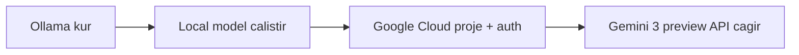

# AI Asistan Kampusu

<div align="center">

### Sekilli Sukullu Ogrenci Baslangic Rehberi

`Local AI + Cloud AI = Daha hizli ogrenme`

[](https://docs.ollama.com/quickstart)
[](https://docs.cloud.google.com/vertex-ai/generative-ai/docs/start/get-started-with-gemini-3)
[](https://docs.cloud.google.com/vertex-ai/generative-ai/docs/start/quickstart)

</div>

```text
 ____  ____     _   _ _____ _   _ _  __      _    ____ ___ _
|  _ \|  _ \   | | | |  ___| | | | |/ /     / \  / ___|_ _| |
| | | | |_) |  | | | | |_  | | | | ' /     / _ \ \___ \| || |
| |_| |  _ <   | |_| |  _| | |_| | . \    / ___ \ ___) | || |___
|____/|_| \_\   \___/|_|    \___/|_|\_\  /_/   \_\____/___|_____|
```

> [!IMPORTANT]
> Gemini 3 preview "indirilen bir program" degil, Google Cloud Vertex AI uzerinden API ile kullanilan bir model ailesidir.

## 0) Yol Haritasi bak mermaid kodumuza nasılda kurulum gerektirmeden çalışıyor !



## 1) Ollama Kurulumu (Local AI)

### Windows
1. `OllamaSetup.exe` ile kurulum yap:  
   https://docs.ollama.com/windows
2. Terminali yeniden ac.
3. Kontrol et:

```powershell
ollama -v
```

### Linux

```bash
curl -fsSL https://ollama.com/install.sh | sh
ollama -v
```

### Ilk modelini calistir

```powershell
ollama run gemma3
```

Ollama API varsayilan olarak burada calisir: `http://localhost:11434`

### Terminalde bunu da yazin (egitim notu)

```powershell
ollama run gemini-3-flash-preview
```

Bu komutun amaci farki gostermek: `gemini-3-flash-preview` bir Ollama modeli degildir, Vertex AI modelidir. Ama kodumuz bu cloud ile çalışmaktadır. O yüzden gemma ile çalıştığını dene ve bununda çalıştığından emin ol. Her hangi bir para ödemene gerek yok kota sınırı var okadar !

## 2) Google Cloud Gemini 3 Preview (Vertex AI)

### Once gerekli olanlar
- Google Cloud projesi
- Billing acik olmali
- Vertex AI API aktif olmali
- `gcloud` CLI kurulu olmali

### gcloud giris ve kimlik

```powershell
gcloud init
gcloud auth application-default login
```

### Proje ve API ayari

```powershell
gcloud config set project YOUR_PROJECT_ID
gcloud services enable aiplatform.googleapis.com
```

### Python SDK kurulumu

```powershell
pip install --upgrade google-genai
```

### Ortam degiskenleri (PowerShell)

```powershell
$env:GOOGLE_CLOUD_PROJECT="YOUR_PROJECT_ID"
$env:GOOGLE_CLOUD_LOCATION="global"
$env:GOOGLE_GENAI_USE_VERTEXAI="True"
```

### Ilk Gemini 3 Preview istegi

```python
from google import genai

client = genai.Client()

response = client.models.generate_content(
    model="gemini-3-flash-preview",
    contents="Merhaba! Bana 3 maddede Python'da for dongusunu anlat.",
)

print(response.text)
```


## 3) Mini Ogrenci Challenge
1. Terminalde su komutu yaz: `ollama run gemini-3-flash-preview`
2. Sonra Ollama'da gecerli bir modelle sor: `ollama run gemma3`
3. Ayni soruyu Gemini 3 preview ile sor.
4. Cevaplari hiz, detay ve dogruluk acisindan karsilastir.

## 4) Hata Cozme Kisa Notlari
- `403` alirsan: Billing, Vertex AI API ve IAM rol (`roles/aiplatform.user`) kontrol et.
- `401` alirsan: `gcloud auth application-default login` komutunu yeniden calistir.
- `Model not found` alirsan: model ID'yi kontrol et (`gemini-3-flash-preview`, `gemini-3-pro-preview`, `gemini-3.1-pro-preview`).

## Kaynaklar (Resmi)
- Ollama Quickstart: https://docs.ollama.com/quickstart
- Ollama Windows: https://docs.ollama.com/windows
- Ollama Linux: https://docs.ollama.com/linux
- Vertex AI Quickstart: https://docs.cloud.google.com/vertex-ai/generative-ai/docs/start/quickstart
- Gemini 3 Baslangic: https://docs.cloud.google.com/vertex-ai/generative-ai/docs/start/get-started-with-gemini-3
- Gemini 3 Pro Model: https://docs.cloud.google.com/vertex-ai/generative-ai/docs/models/gemini/3-pro
- Gemini 3 Flash Model: https://docs.cloud.google.com/vertex-ai/generative-ai/docs/models/gemini/3-flash
