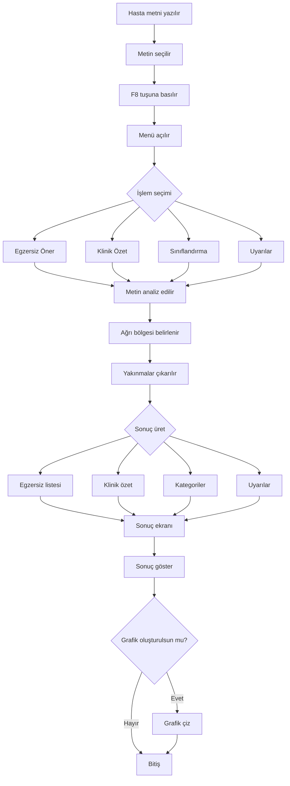

# Fizik Tedavi Egzersiz Öneri Sistemi

## Proje Tanımı

Bu proje, fizik tedavi alanında kullanılmak üzere geliştirilmiş, hasta şikayet metnini analiz eden ve kullanıcıya çeşitli destek çıktıları sunan bir masaüstü uygulamasıdır. Sistem, yazılı olarak girilen hasta yakınmalarını değerlendirerek temel egzersiz önerileri, klinik özet, egzersiz sınıflandırması ve dikkat edilmesi gereken uyarılar üretmektedir.

Uygulamanın temel amacı, fizik tedavi uzmanının veya ilgili kullanıcının hasta şikayetlerini daha düzenli ve hızlı değerlendirebilmesine yardımcı olmaktır. Sistem bir tanı koyma aracı değildir. Bunun yerine, metin tabanlı bilgi girişini işleyerek karar destek mantığında çalışan yardımcı bir uygulama olarak tasarlanmıştır.

---

## Projenin Amacı

- Ağrı veya şikayet bölgesini belirlemek  
- Şikayet metninden temel yakınmaları çıkarmak  
- İlgili bölgeye uygun egzersiz önerileri sunmak  
- Egzersizleri kategorilere ayırmak  
- Kullanıcıya dikkat edilmesi gereken noktaları göstermek  
- Verileri grafiksel olarak sunmak  

---

## Problem Tanımı

Fizik tedavi sürecinde hasta şikayetleri genellikle metin şeklinde alınmaktadır. Bu bilgilerin hızlı şekilde analiz edilmesi, sınıflandırılması ve öneriye dönüştürülmesi zor olabilir.

Bu proje, metin içerisindeki anahtar kelimeleri analiz ederek:

- Şikayet bölgesini belirler  
- Temel semptomları çıkarır  
- Egzersiz önerileri üretir  
- Kullanıcıya rehberlik eder  

---

## Temel Özellikler

- Metin analizi  
- Bölge tespiti  
- Egzersiz önerisi  
- Klinik özet oluşturma  
- Egzersiz sınıflandırma  
- Uyarı sistemi  
- Grafik oluşturma  
- F8 kısayolu ile hızlı kullanım  
- Basit masaüstü arayüz  

---

## Kullanım

1. Hasta şikayet metni yazılır  
2. Metin seçilir  
3. F8 tuşuna basılır  
4. Menüden işlem seçilir  
5. Sonuç ekranda gösterilir  

---

## Menü İşlemleri

### Egzersiz Öner
Hasta metnine göre uygun egzersiz listesi oluşturur.

### Klinik Özet
Hasta metnini kısa ve düzenli bir özet haline getirir.

### Egzersizleri Sınıflandır
Egzersizleri kategorilere ayırır ve sayısal dağılım verir.

### Uyarılar ve Dikkat Noktaları
Egzersiz sırasında dikkat edilmesi gerekenleri listeler.

---

## Akış Diyagramı


```mermaid
flowchart TD
A[Hasta metni yazılır] --> B[Metin seçilir]
B --> C[F8 tuşuna basılır]
C --> D[Menü açılır]
D --> E{İşlem seçimi}

E --> F[Egzersiz Öner]
E --> G[Klinik Özet]
E --> H[Sınıflandırma]
E --> I[Uyarılar]

F --> J[Metin analiz edilir]
G --> J
H --> J
I --> J

J --> K[Ağrı bölgesi belirlenir]
K --> L[Yakınmalar çıkarılır]

L --> M{Sonuç üret}
M --> N[Egzersiz listesi]
M --> O[Klinik özet]
M --> P[Kategoriler]
M --> Q[Uyarılar]

N --> R[Sonuç ekranı]
O --> R
P --> R
Q --> R

R --> S[Sonuç göster]
S --> T{Grafik oluşturulsun mu?}
T -->|Evet| U[Grafik çiz]
T -->|Hayır| V[Bitiş]
U --> V
```

---

## Kullanılan Teknolojiler

- Python 3  
- Tkinter  
- PyAutoGUI  
- Pyperclip  
- Pynput  
- Matplotlib  
- Regex (re modülü)  

---

## Kurulum ve Çalıştırma

```bash
cd fizik_tedavi_ai_proje

python3 -m venv .venv
source .venv/bin/activate

pip install pyperclip pynput pyautogui matplotlib

python main.py
```